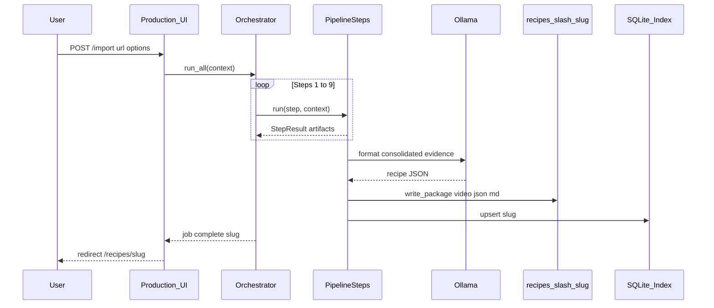

# CookBook — Architecture (modeled on Pick-a-Recipe)

> **Reference project:** [pickeld/pick-a-recipe](https://github.com/pickeld/pick-a-recipe) — AI-powered recipe extraction from TikTok, YouTube, and Instagram with upload to Tandoor/Mealie.  
> **This document** maps that proven architecture onto CookBook’s goals: local-first storage, Ollama formatting, step-based pipeline, and three operator-facing GUIs.

Related docs: [`MASTER_CONTEXT.md`](mot/MASTER_CONTEXT.md) · [`SOFTWARE_REQUIREMENTS.md`](SOFTWARE_REQUIREMENTS.md) · [`DOCKER.md`](DOCKER.md) · [`RECIPE_REPO_PLAN.md`](RECIPE_REPO_PLAN.md)

---

## 1. Problem space (shared)

Both projects solve the same core problem:

| Stage | What happens |
|-------|----------------|
| Input | User pastes a social video URL (Instagram Reel, TikTok, YouTube, …) |
| Acquire | Download video + platform metadata (`yt-dlp`) |
| Listen | Transcribe spoken audio (`faster-whisper`) |
| See | Extract on-screen text (ingredients, steps) |
| Synthesize | LLM turns evidence into structured recipe JSON |
| Deliver | User browses, edits, and uses recipes |

**Pick-a-Recipe** optimizes for *push to an existing recipe manager* (Mealie/Tandoor) with cloud LLMs and a single Flask PWA.  
**CookBook** optimizes for *own the full package locally* (video + transcript + JSON + Markdown) with local Ollama and operator tooling (testing/deployment GUIs).

---

## 2. Side-by-side architecture

```mermaid
flowchart TB
    subgraph par [Pick_a_Recipe]
        parUI[Flask_UI_SocketIO]
        parPipe[pipeline.py]
        parDL[video_downloader]
        parTR[transcriber]
        parIMG[image_extractor]
        parChef[chef.py]
        parLLM[llm_providers_OpenAI_Gemini]
        parUp[mealie_tandoor]
        parDB[(SQLite_config_jobs)]
        parUI --> parPipe
        parPipe --> parDL --> parTR --> parChef
        parTR --> parLLM
        parChef --> parLLM
        parPipe --> parIMG
        parChef --> parUp
        parUI --> parDB
    end

    subgraph cb [CookBook]
        cbUI[FastAPI_Production_8080]
        cbTest[Testing_GUI_8081]
        cbDeploy[Deployment_GUI_8082]
        cbOrch[PipelineOrchestrator]
        cbSteps[steps_1_to_9]
        cbDL[downloader_ytdlp]
        cbWhisper[transcription_whisper]
        cbVis[vision_tesseract]
        cbFmt[extraction_ollama]
        cbStore[storage_package]
        cbIdx[(SQLite_search_index)]
        cbOllama[Ollama_sidecar]
        cbUI --> cbOrch
        cbTest --> cbSteps
        cbOrch --> cbSteps
        cbSteps --> cbDL --> cbWhisper --> cbVis --> cbFmt
        cbFmt --> cbOllama
        cbSteps --> cbStore --> cbIdx
        cbUI --> cbStore
    end
```



### Comparison table

| Concern | Pick-a-Recipe | CookBook |
|---------|---------------|----------|
| **Primary output** | Upload to Mealie/Tandoor API | `recipes/<slug>/` package on disk |
| **Web stack** | Flask + SocketIO + PWA | FastAPI + Jinja2 (server-rendered) |
| **Recipe LLM** | OpenAI / Gemini (cloud) | Ollama `qwen2.5:7b-instruct` (local) |
| **Vision / OCR** | Vision-capable LLM on frames | Tesseract OCR on extracted frames (optional) |
| **Transcription** | `faster-whisper` + cache files | `faster-whisper` (GPU sequential with formatter) |
| **Pipeline shape** | One `pipeline.py` with `ProgressReporter` | Nine `PipelineStep` classes + orchestrator |
| **Progress UX** | WebSocket real-time % | Sync import today; job status polling planned |
| **Config** | SQLite settings DB + web `/settings` | `.env` + Deployment GUI (planned env editor) |
| **Auth** | Local accounts / Authentik OIDC | Open on LAN (personal server); auth TBD |
| **CLI** | `main.py` shares `pipeline.py` | `app.cli` + `MODE=import` |
| **Deploy** | Single image `pickeld/pick-a-recipe` | Compose: `cookbook` + `ollama` sidecar |
| **Mobile** | Android app + PWA share target | Not in scope (web-first) |
| **Shopping list** | Via Mealie/Tandoor | Built-in HEB aisle merge |
| **Operator tools** | Settings page only | Testing GUI (per-step) + Deployment GUI |

---

## 3. Pick-a-Recipe pipeline (reference)

From [`pipeline.py`](https://github.com/pickeld/pick-a-recipe/blob/main/pipeline.py):

```text
URL
  → fetch info (yt-dlp metadata)
  → download video
  → transcribe audio (Whisper, file-cached per language)
  → extract visual text (vision LLM, file-cached)
  → combine AUDIO + ON-SCREEN sections
  → extract dish image candidates
  → chef.create_recipe() (cloud LLM)
  → [optional] preview / user approval
  → upload to Mealie and/or Tandoor
```

**Patterns worth adopting:**

| Pattern | Pick-a-Recipe implementation | CookBook status |
|---------|------------------------------|-----------------|
| Shared pipeline for CLI + web | `run_extraction_pipeline()` used by both | ✅ `PipelineOrchestrator` + same `app/steps/*` |
| Progress callback interface | `ProgressReporter` protocol (`update`, `is_cancelled`) | ⚠️ Partial — `StepResult` + debug log; no % UI yet |
| Per-stage file cache | `transcription_{lang}.txt`, `visual_{lang}.txt` | ✅ Dataset + working dirs; idempotent re-runs |
| Graceful vision failure | Visual step warns, pipeline continues | ✅ Vision optional via toggle |
| Preview before persist | `CONFIRM_BEFORE_UPLOAD` + `PreviewWaiter` | 🔲 Future — editor/review step |
| Cancellation | `reporter.is_cancelled()` between stages | 🔲 Future |
| Dual source routing | `run_url_pipeline()` — video vs webpage | 🔲 Instagram-only MVP; webpage later |
| Token/cost tracking | `PipelineStats.llm_tokens_estimate` | 🔲 Optional for local Ollama |

---

## 4. CookBook pipeline (target)

Nine explicit steps (see [`MASTER_CONTEXT.md`](mot/MASTER_CONTEXT.md)):

```text
Instagram Reel URL + user options (OCR on/off, comment, custom instruction)
  │
  ├─[1] Download          → dataset/raw/{id}.mp4, dataset/metadata/{id}.json
  ├─[2] Extract audio     → working/{job_id}/audio.wav
  ├─[3] Transcribe        → dataset/transcripts/{id}.txt + .json
  ├─[4] Extract frames    → working/{job_id}/frames/          (if video_processing)
  ├─[5] Vision / OCR      → working/{job_id}/vision.json      (if video_processing)
  ├─[6] Consolidate       → merged evidence object (transcript + OCR + caption + user notes)
  ├─[7] Format recipe     → draft recipe.json (Ollama)
  ├─[8] Normalize + MD    → validated recipe.json + recipe.md (deterministic, no LLM)
  └─[9] Store + index     → recipes/{slug}/ package + SQLite upsert
```



**Design choice vs Pick-a-Recipe:** CookBook splits *evidence gathering* (steps 1–6) from *generation* (7) and *deterministic output* (8–9). Pick-a-Recipe folds transcription, vision, and generation into fewer modules but relies on cloud LLMs for vision and formatting.

---

## 5. Project structure (mapped)

### Pick-a-Recipe layout

```text
pick-a-recipe/
├── main.py                 # CLI
├── pipeline.py             # Shared extraction pipeline
├── chef.py                 # LLM recipe generation
├── video_downloader.py
├── transcriber.py
├── image_extractor.py
├── llm_providers/          # OpenAI, Gemini
├── mealie.py / tandoor.py  # Export targets
├── ui/                     # Flask app, job manager, templates
└── docker-compose.yml
```

### CookBook layout (`cursor1/`)

```text
cursor1/
├── app/
│   ├── steps/              # ≡ pipeline stages (one module per step)
│   │   ├── step01_download.py
│   │   ├── step02_extract_audio.py
│   │   ├── …
│   │   └── step09_store_index.py
│   ├── workflow/
│   │   ├── orchestrator.py # ≡ pipeline.py coordinator
│   │   └── factory.py
│   ├── downloader/         # ≡ video_downloader.py
│   ├── transcription/      # ≡ transcriber (audio only)
│   ├── vision/             # ≡ visual text (Tesseract, not vision LLM)
│   ├── extraction/         # ≡ chef.py (Ollama formatter)
│   ├── formatting/         # deterministic Markdown (no LLM)
│   ├── storage/            # ≡ local package (replaces Mealie/Tandoor as sink)
│   ├── search/             # SQLite browse/search
│   ├── web/
│   │   ├── apps.py         # ≡ ui/app.py (production + testing + deployment)
│   │   ├── templates/
│   │   └── static/
│   ├── cli/                # ≡ main.py
│   ├── shopping/           # CookBook-specific
│   └── bugreport/          # CookBook-specific
├── scripts/
│   ├── docker-entrypoint.sh
│   └── seed_demo_recipes.py
├── docker-compose.yml      # cookbook + ollama
├── dataset/                # Phase 0 batch artifacts
├── recipes/                # Phase 1+ canonical packages
└── tests/
```

---

## 6. Web layer

### Pick-a-Recipe

| Piece | Role |
|-------|------|
| `ui/app.py` | Routes, auth, settings |
| `ui/job_manager.py` | Background workers, queue, approval handoff |
| Flask-SocketIO | Live progress bar |
| PWA manifest | Android/iOS share-to-app |
| SQLite | Users, jobs, API keys, history |

### CookBook (three GUIs, one codebase)

| GUI | `MODE` | Port | Audience | Pick-a-Recipe equivalent |
|-----|--------|------|----------|------------------------|
| **Production** | `web` | 8080 | End user | Main Flask UI (import, browse, recipe view) |
| **Testing** | `testing-gui` | 8081 | Developer | No direct equivalent — step runner + artifact inspector |
| **Deployment** | `deployment-gui` | 8082 | Deployer | Docker deploy scripts + settings, not in PAR |

**Production routes (implemented):**

| Route | Purpose |
|-------|---------|
| `GET /` | Import landing (hero + form) |
| `GET /recipes` | Browse + search |
| `GET /recipes/{slug}` | Recipe detail + embedded video |
| `GET /recipes/{slug}/video` | Serve `video.mp4` |
| `POST /import` | Trigger full orchestrator |
| `GET /shopping` | Multi-recipe shopping list |

**Gaps vs Pick-a-Recipe UX (candidates for next increments):**

- Background import job + progress polling (PAR: SocketIO; CookBook: `GET /import/{job_id}/status`)
- Real-time stage labels matching `ProgressReporter.update(stage, message, percent)`
- Preview / confirm before store (PAR: `CONFIRM_BEFORE_UPLOAD`)
- Settings page in Production UI (PAR: `/settings` for LLM keys; CookBook: Deployment GUI + `.env`)

---

## 7. Data model

### Pick-a-Recipe

- **Runtime:** SQLite (`data/pick-a-recipe.db`) — config, users, jobs
- **Output:** Remote recipe manager (Mealie/Tandoor) — no local video archive by default
- **Cache:** Per-video work dir with transcription/visual caches

### CookBook

- **Source of truth:** Filesystem `recipes/<slug>/`

```text
recipes/<slug>/
├── video.mp4           # original reel (like PAR dish video, but full reel)
├── recipe.json         # canonical structured recipe (Pydantic)
├── recipe.md           # deterministic render
├── metadata.json       # source URL, creator, pipeline version
├── transcript.txt      # raw evidence (immutable)
├── transcript.json     # timestamped segments
└── vision.json         # OCR evidence (optional)
```

- **Derived index:** `data/db/recipes.db` (SQLite search — title, ingredients, body text)
- **Dataset (Phase 0):** `dataset/raw/`, `dataset/transcripts/`, `dataset/manifest.json`
- **Scratch:** `working/<job_id>/` — audio, frames, debug.log

**Rule (both projects):** Generated recipe must not overwrite raw transcript/OCR evidence.

---

## 8. Provider interfaces

CookBook uses the same *swappable backend* idea as Pick-a-Recipe’s `llm_providers/`:

| Interface | CookBook module | Default impl | Pick-a-Recipe analog |
|-----------|-----------------|--------------|----------------------|
| `DownloaderProvider` | `app/downloader/` | `ytdlp.py` | `video_downloader.py` |
| `TranscriptionProvider` | `app/transcription/` | `whisper.py` | `transcriber.py` (audio) |
| `VisionProvider` | `app/vision/` | `tesseract.py` | `transcriber.extract_visual_text()` (LLM) |
| `FormatterProvider` | `app/extraction/` | `ollama_formatter.py` | `chef.py` + `llm_providers/*` |

**CookBook constraint:** Whisper and Ollama must not load on GPU simultaneously (8 GB VRAM) — sequential unload between steps 3 and 7.

---

## 9. Deployment

### Pick-a-Recipe

```text
docker run -p 5006:5006 -v pick-a-recipe-data:/app/data pickeld/pick-a-recipe:latest
```

Single container; cloud API keys required for LLM.

### CookBook

```text
cd cursor1
docker compose up -d --build          # production web on :8080
docker compose -f docker-compose.gpu.yml …  # GPU override for Whisper
```

| Service | Image | Role |
|---------|-------|------|
| `cookbook` | `docker/Dockerfile` | App, ffmpeg, yt-dlp, faster-whisper, Tesseract |
| `ollama` | `ollama/ollama:latest` | Local formatter only (internal network) |

Volumes (bind mounts): `recipes/`, `dataset/`, `working/`, `data/db`, `data/whisper-cache`, `data/ollama`.

---

## 10. Recommended adoptions from Pick-a-Recipe

Prioritized for CookBook without copying cloud dependencies:

| Priority | Adoption | Rationale |
|----------|----------|-----------|
| **P0** | `ProgressReporter`-style callback from orchestrator → web UI | Users expect stage + % during long imports |
| **P0** | Background import worker + job table | Avoid blocking HTTP request during Whisper/Ollama |
| **P1** | Per-job work dir caches (like PAR `dish_dir/transcription_*.txt`) | Faster re-runs when tweaking formatter only |
| **P1** | `CONFIRM_BEFORE_UPLOAD` equivalent before step 9 | Review draft recipe when formatter uncertain |
| **P2** | Web recipe URL path (`web_recipe_fetcher.py`) | Extend beyond Instagram |
| **P2** | Dish/thumbnail frame picker | PAR `image_extractor` — hero image for browse cards |
| **P3** | PWA + share target | Mobile share sheet (PAR strength) |
| **—** | Mealie/Tandoor export adapter | Optional `uploaders.py`-style plugin if user already runs Mealie |

**Explicit non-goals (CookBook differs on purpose):**

- Cloud LLM as default (privacy, cost, offline personal server)
- Single monolithic `pipeline.py` (prefer testable steps + Testing GUI)
- Storing secrets in SQLite from web UI (use `.env` + Deployment GUI)

---

## 11. Entry points

| Action | Pick-a-Recipe | CookBook |
|--------|---------------|----------|
| Web import | `python ui/app.py` → paste URL | `MODE=web` → `http://localhost:8080` |
| CLI import | `python main.py <url>` | `docker compose run -e MODE=import cookbook <url>` |
| Batch dataset | — | `MODE=download` / `MODE=transcribe` |
| Step debug | — | `MODE=testing-gui` → run step N only |
| Stack ops | Portainer scripts | `MODE=deployment-gui` (planned compose controls) |
| Demo data | — | `python scripts/seed_demo_recipes.py` |

---

## 12. Summary

Pick-a-Recipe validates the product: **download → transcribe → read screen → LLM → recipe manager**. CookBook keeps that pipeline but changes four architectural bets:

1. **Local sink** — own `recipes/<slug>/` packages instead of external Mealie/Tandoor as primary store  
2. **Local LLM** — Ollama sidecar instead of OpenAI/Gemini  
3. **Explicit steps** — nine `PipelineStep` modules for testability and the Testing GUI  
4. **Split audiences** — Production / Testing / Deployment GUIs instead of one Flask app with settings buried inside  

Use Pick-a-Recipe as the **UX and pipeline-flow reference**; use CookBook’s [`SOFTWARE_REQUIREMENTS.md`](SOFTWARE_REQUIREMENTS.md) and [`mot/INCREMENTS.md`](mot/INCREMENTS.md) as the **implementation authority**.
