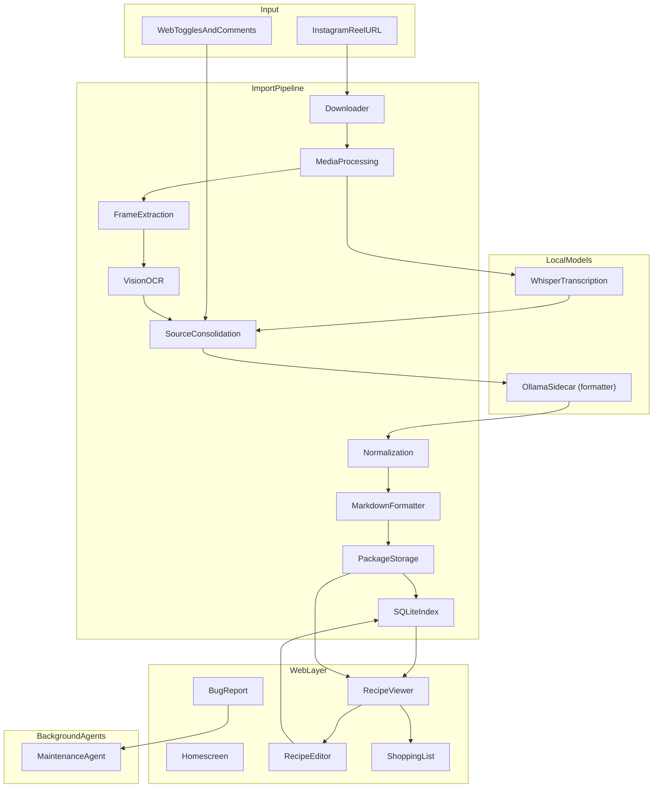

# MASTER CONTEXT DOCUMENT (Prompt 0)

> Load this document at the start of every development session to prevent context drift.

## 1. Domain Background & Theory

CookBook is a **local-first recipe repository agent**. Users share Instagram Reel URLs containing cooking videos. The system:

1. Downloads the original video and metadata
2. Extracts and transcribes audio (Whisper, local)
3. Optionally extracts video frames and runs OCR/vision for on-screen text
4. Consolidates all evidence (transcript, OCR, metadata, user comments)
5. Uses a recipe formatter model to produce validated structured JSON
6. Renders deterministic Markdown, stores a complete recipe package, and indexes for search

Recipe reels often contain critical information in on-screen text that is never spoken. Raw evidence (transcript, vision) must remain separate from generated recipe data. The formatter must mark uncertain values rather than invent quantities.

**Model strategy (two separate concerns):**

- **Transcription:** faster-whisper (local Whisper) — always local, MVP
- **Recipe formatting:** Ollama sidecar (compose service) — bootstrap small model during MVP → custom `cookbook-formatter` after distillation (LoRA/Unsloth)

See [`DISTALATION.MD`](../DISTALATION.MD) for distillation workflow.

## 2. System Architecture Overview

```text
Instagram Reel URL + Web Options (toggles, comments, custom instruction)
      |
      v
[1] Download video + metadata          (yt-dlp)
[2] Extract audio                      (ffmpeg)
[3] Transcribe audio                   (Whisper / faster-whisper)
[4] Extract video frames               (ffmpeg, optional)
[5] OCR / vision analysis              (provider interface, optional)
[6] Source consolidation               (transcript + vision + metadata)
[7] Recipe formatter                   (Ollama HTTP API — teacher → distilled)
[8] Normalization + Markdown           (deterministic, no LLM)
[9] Store recipe package + SQLite index
      |
      v
Web UI: viewer, editor, ratings, shopping list, bug reports
Maintenance agent: scheduled review of debug logs and bug reports
```



## 3. Component Specifications

| Module | Responsibility | Interface |
|---|---|---|
| `downloader/` | Validate URL, download video + metadata via yt-dlp | `DownloaderProvider` |
| `media/` | Extract audio (mono 16kHz WAV), video duration | — |
| `transcription/` | Audio → timestamped transcript | `TranscriptionProvider` (Whisper) |
| `vision/` | Frame OCR / on-screen text extraction | `VisionProvider` |
| `extraction/` | Source consolidation + recipe formatter via Ollama API | `FormatterProvider` → `http://ollama:11434` |
| `formatting/` | Deterministic JSON → Markdown | — |
| `storage/` | Recipe package filesystem layout | — |
| `search/` | SQLite index (recipes, ingredients, tags) | — |
| `workflow/` | CLI import orchestration (9 stages) | — |
| `web/` | Homescreen, viewer, editor, ratings | — |
| `shopping/` | Multi-recipe shopping list, HEB aisle order | — |
| `bugreport/` | User bug reports + debug log capture | — |

## 4. Performance Metrics & Thresholds

| Metric | Green | Yellow | Red |
|---|---|---|---|
| Import success rate | ≥ 95% | 80–94% | < 80% |
| Schema validation pass rate | 100% | — | < 100% |
| Transcription segments / video minute | ≥ 8 | 4–7 | < 4 |
| OCR frame coverage (when enabled) | ≥ 90% duration sampled | 70–89% | < 70% |
| Search query latency | < 200ms | 200–500ms | > 500ms |
| Recipe detail page load | < 2s | 2–5s | > 5s |

## 5. Technical Constraints

- **Local-first:** filesystem is source of truth; no cloud dependency for core operation
- **8GB GPU VRAM:** Whisper and formatter loaded sequentially, never concurrently
- **No secrets in repo:** API keys via environment variables only
- **Provider interfaces:** transcription, vision, and formatter must be swappable
- **Raw evidence immutable:** formatter never overwrites transcript files
- **Idempotent imports:** duplicate detection by source URL before re-import
- **Personal server deployment:** single-user initially; multi-user TBD
- **Docker-first deployment:** all runtime deps in container; host needs Docker Engine + NVIDIA Container Toolkit only
- **Sequential GPU jobs:** only one import pipeline runs GPU stages at a time (worker lock inside container)

## 6. Dependencies & Prerequisites

### Host (install once on personal server)

| Dependency | Purpose | Required |
|---|---|---|
| Docker Engine 24+ | Run containers | Yes |
| Docker Compose v2 | Orchestration | Yes |
| NVIDIA Container Toolkit | GPU passthrough | Yes (GPU hosts) |
| NVIDIA driver | CUDA on host | Yes (GPU hosts) |

### Container (baked into Docker image — see [`DOCKER.md`](../DOCKER.md))

| Dependency | Purpose | Required |
|---|---|---|
| Python 3.12+ | Primary language | Yes |
| ffmpeg | Audio/video processing | Yes |
| yt-dlp | Instagram video download | Yes |
| faster-whisper + CUDA (ctranslate2) | Local transcription | Yes |
| pydantic | Schema validation | Yes |
| pytest | Testing (dev/test image) | Yes |
| sqlite3 (stdlib) | Search index | Yes |
| httpx | Ollama HTTP API client | Yes |
| ollama/ollama (compose) | Recipe formatter inference | Yes |
| Unsloth | LoRA distillation training | Later — separate `Dockerfile.train` |

### Persistent volumes

| Volume | Contents |
|---|---|
| `./recipes` (bind mount) | Recipe packages — source of truth |
| `./working` (bind mount) | Import job scratch |
| `cookbook-db` (named) | SQLite `recipes.db` |
| `whisper-cache` (named) | faster-whisper model weights |
| `ollama-models` (named) | Ollama formatter model weights |

## 7. Source Documents

- [`DOCKER.md`](../DOCKER.md) — container deployment, dependency map, compose files
- [`SOFTWARE_REQUIREMENTS.md`](../SOFTWARE_REQUIREMENTS.md) — authoritative requirements (being filled incrementally)
- [`RECIPE_REPO_PLAN.md`](../RECIPE_REPO_PLAN.md) — pipeline phases and implementation order
- [`DISTALATION.MD`](../DISTALATION.MD) — model distillation strategy
- [`INCREMENTS.md`](INCREMENTS.md) — ordered development increments
- [`TRACKING_MATRIX.md`](TRACKING_MATRIX.md) — metrics across increments and variants
